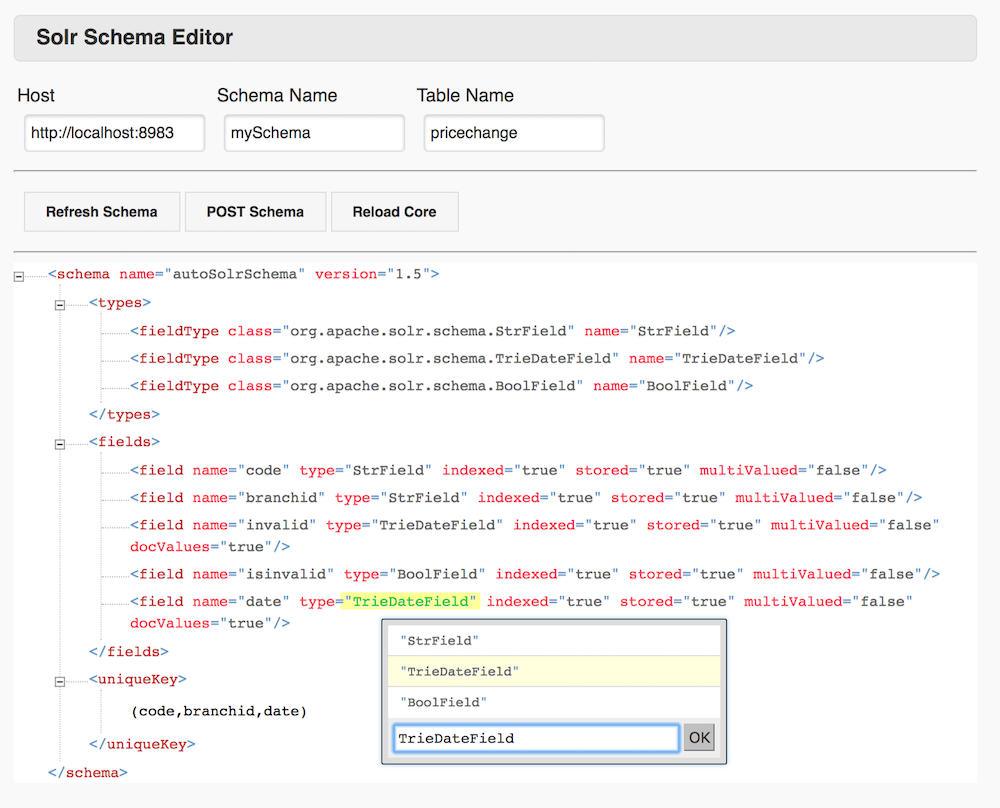

#Solr Schema Editor

The purpose of this project is to enhance the user experience of changing Solr schema documents, by improving the process of modifying Solr schema documents with automation, and adding a practical gui. 

## Built on three simple technologies
* Spring Boot - Create Standalone "Just Run" light-weight spring applications
* Xonomy Java Script Library - Plugin for XML Document Mutations http://www.lexiconista.com/Xonomy/xonomy.pdf
* Solr REST API - Access for schema access, publishing, and Solr core reloading.





## How do I run it

* From Source
```
./mvn clean package spring-boot:run
```
* From Binary
```
./java -jar solr-schema-editor.war 
```

## How do I use it
* Refresh - pull existing schema from Solr Core.
* POST - push modified schema to Solr Core.
* Reload - relead solr core if changes are valid.

## How do I improve it
Additional options to the xml can be added by modifying the following js file, and quickly reviewing the js library documentation http://www.lexiconista.com/Xonomy/xonomy.pdf
```
/src/resources/public/js/xonomy/solr/schemaHelper.js
```
